# 🛒 AI-Powered E-Commerce Analytics & Customer Intelligence System

<div align="center">


**An end-to-end Data Analytics + Machine Learning + Deep Learning project on real E-Commerce data.**
From raw CSV → Cleaning → EDA → SQL → Dashboard → ML → Deep Learning → Insights.

[📊 View EDA Charts](#-eda-visualizations) • [🤖 ML Models](#-machine-learning-models) • [🗄️ SQL Queries](#️-sql-business-analysis) • [📈 Dashboard](#-power-bi-dashboard) • [🚀 Run Locally](#-installation--setup)

</div>

---

## 📌 Table of Contents

1. [Project Overview](#-project-overview)
2. [Business Objectives](#-business-objectives)
3. [Project Workflow](#-project-workflow)
4. [Dataset Information](#-dataset-information)
5. [Technologies Used](#-technologies-used)
6. [Project Structure](#-project-structure)
7. [Data Cleaning](#-data-cleaning)
8. [Feature Extraction](#-feature-extraction)
9. [EDA Visualizations](#-eda-visualizations)
10. [SQL Business Analysis](#️-sql-business-analysis)
11. [Power BI Dashboard](#-power-bi-dashboard)
12. [Machine Learning Models](#-machine-learning-models)
13. [Deep Learning Models](#-deep-learning-models)
14. [Key Business Insights](#-key-business-insights)
15. [Installation & Setup](#-installation--setup)
16. [Resume Description](#-resume-project-description)
17. [Author](#-author)

---

## 🎯 Project Overview

This project is a **complete, production-style Data Analytics and AI system** built on real E-Commerce transactional data.

The goal is to answer real business questions:

> *"Which products make the most money? Which customers are at risk of leaving? What will sales look like next quarter?"*

This project covers the **entire Data Scientist workflow** — from raw messy data all the way to Machine Learning models and interactive dashboards.

| Phase | What Was Done |
|---|---|
| 📦 Data Cleaning | Removed duplicates, fixed dates, handled nulls |
| 🔬 Feature Extraction | Created 12 new business features |
| 📊 EDA | 23 charts across 10 analysis sections |
| 🗄️ SQL | 40 queries — Basic to Advanced (Window, CTE, RFM) |
| 📈 Power BI | Interactive KPI Dashboard |
| 🤖 Machine Learning | Sales Prediction, Customer Segmentation, CLV |
| 🧠 Deep Learning | LSTM Forecasting, Fraud Detection, Sentiment Analysis |
| 💡 Insights | 10+ actionable business findings |

---

## 💼 Business Objectives

| # | Business Problem | Solution Built |
|---|---|---|
| 1 | Which products generate highest revenue? | EDA + SQL Top Products Analysis |
| 2 | Which regions are underperforming? | Regional Sales Analysis + Power BI |
| 3 | Who are our most valuable customers? | RFM Analysis + Customer Segmentation |
| 4 | What will sales look like next month? | LSTM Deep Learning Forecasting |
| 5 | Which customers are about to leave? | RFM At-Risk Segment Detection |
| 6 | Are there any fraudulent transactions? | Autoencoder Anomaly Detection |
| 7 | What products should we recommend? | Collaborative Filtering System |
| 8 | What do customers think about products? | BERT Sentiment Analysis |
| 9 | What is each customer's long-term value? | CLV Prediction using Random Forest |
| 10 | Which discounts are hurting profit? | Discount vs Profit Correlation Analysis |

---

## 🔄 Project Workflow

```
Raw CSV Data (train.csv)
        │
        ▼
┌─────────────────────┐
│   1. Data Cleaning  │  → Remove duplicates, fix dates, handle nulls
└─────────────────────┘
        │
        ▼
┌──────────────────────────┐
│   2. Feature Extraction  │  → 12 new features (Season, RFM scores, etc.)
└──────────────────────────┘
        │
        ▼
┌──────────────────────────────────┐
│   3. EDA + Advanced EDA          │  → 23 charts, 10 analysis sections
└──────────────────────────────────┘
        │
        ▼
┌──────────────────────────┐
│   4. SQL Analysis        │  → 40 queries (Basic → CTE → Window → RFM)
└──────────────────────────┘
        │
        ▼
┌──────────────────────────┐
│   5. Power BI Dashboard  │  → KPIs, Trends, Regional, Customer views
└──────────────────────────┘
        │
        ▼
┌──────────────────────────────────────────────┐
│   6. Machine Learning                        │
│      Sales Prediction / Segmentation / CLV  │
└──────────────────────────────────────────────┘
        │
        ▼
┌──────────────────────────────────────────────────────────────┐
│   7. Deep Learning                                           │
│      LSTM Forecasting / Fraud Detection / Sentiment / NLP   │
└──────────────────────────────────────────────────────────────┘
        │
        ▼
┌──────────────────────┐
│   8. Business Report │  → Final insights + Resume-ready project
└──────────────────────┘
```

---

## 📂 Dataset Information

| Property | Detail |
|---|---|
| **Dataset Name** | Superstore Sales Dataset |
| **Total Rows** | 9,800 orders |
| **Total Columns** | 18 (raw) → 33 (after feature extraction) |
| **Date Range** | January 2015 — December 2018 |
| **Total Revenue** | $2,261,536 |
| **Total Customers** | 793 unique customers |
| **Total Products** | 1,850 unique products |

### 📋 Key Columns

| Column | Description |
|---|---|
| Order ID | Unique order identifier |
| Order Date | Date order was placed |
| Ship Date | Date order was shipped |
| Customer Name | Name of the customer |
| Segment | Consumer / Corporate / Home Office |
| Region | East / West / Central / South |
| Category | Furniture / Office Supplies / Technology |
| Sub-Category | Chairs, Phones, Binders, etc. |
| Sales | Revenue from the order ($) |
| Ship Mode | Standard / First / Second / Same Day |

---

## 🛠️ Technologies Used

| Area | Tools |
|---|---|
| **Language** | Python 3.10+ |
| **Data Analysis** | Pandas, NumPy |
| **Visualization** | Matplotlib, Seaborn, Plotly |
| **Machine Learning** | Scikit-learn, XGBoost |
| **Deep Learning** | TensorFlow, Keras |
| **NLP** | HuggingFace Transformers (BERT) |
| **Database** | MySQL 8.0 |
| **Dashboard** | Power BI |
| **Environment** | Jupyter Notebook, VS Code |

---

## 📁 Project Structure

```
Ecommerce-AI-Analytics-Project/
│
├── 📂 dataset/
│   ├── train.csv                        ← Raw original data
│   ├── cleaned_superstore.csv           ← After data cleaning
│   └── featured_superstore.csv          ← After feature extraction (33 cols)
│
├── 📂 python/
│   ├── data_cleaning.py                 ← Step 1: Cleaning script
│   ├── feature_extraction.py            ← Step 2: Feature engineering
│   ├── eda_complete.py                  ← Step 3: Full EDA (23 charts)
│   └── 📂 charts/                       ← All 23 EDA charts saved here
│       ├── 01_sales_distribution.png
│       ├── 02_category_region_segment.png
│       ├── 03_shipping_analysis.png
│       ├── 04_sales_customer_value.png
│       ├── 05_sales_category_region.png
│       ├── 06_sales_segment_shipmode.png
│       ├── 07_boxplot_sales.png
│       ├── 08_shipping_days.png
│       ├── 09_heatmap_region_category.png
│       ├── 10_segment_category_sales.png
│       ├── 11_heatmap_shipmode_region.png
│       ├── 12_monthly_sales_trend.png
│       ├── 13_yearly_sales_growth.png
│       ├── 14_season_month_sales.png
│       ├── 15_dayofweek_sales.png
│       ├── 16_rfm_segments.png
│       ├── 17_top10_customers.png
│       ├── 18_top10_products.png
│       ├── 19_subcategory_sales.png
│       ├── 20_product_popularity.png
│       ├── 21_correlation_heatmap.png
│       ├── 22_scatter_plots.png
│       └── 23_outlier_detection.png
│
├── 📂 sql/
│   └── ecommerce_sql_analysis.sql       ← 40 queries: Basic → Advanced
│
├── 📂 dashboard/
│   └── Ecommerce_Dashboard.pbix         ← Power BI Dashboard
│
├── 📂 notebooks/
│   ├── eda.ipynb
│   ├── sales_prediction.ipynb
│   ├── customer_segmentation.ipynb
│   ├── recommendation_system.ipynb
│   ├── lstm_forecasting.ipynb
│   ├── sentiment_analysis.ipynb
│   ├── fraud_detection.ipynb
│   └── clv_prediction.ipynb
│
├── 📂 models/                           ← Saved ML/DL model files
├── 📂 screenshots/                      ← Dashboard screenshots
├── requirements.txt
└── README.md
```

---

## 🧹 Data Cleaning

**File:** `python/data_cleaning.py`

| Step | Action | Result |
|---|---|---|
| 1 | Load raw CSV | 9,800 rows, 18 columns |
| 2 | Check missing values | 11 missing Postal Codes found |
| 3 | Fix missing Postal Codes | Filled with 0 |
| 4 | Remove duplicates | 0 duplicates found ✅ |
| 5 | Convert date columns | Text → Real DateTime format |
| 6 | Standardize text columns | Title Case for Region, Segment, Category |
| 7 | Check negative sales | 0 negative sales found ✅ |
| 8 | Save cleaned file | `cleaned_superstore.csv` |

---

## ⚙️ Feature Extraction

**File:** `python/feature_extraction.py`

12 new features created from existing columns:

| # | Feature | Description |
|---|---|---|
| 1 | Season | Winter / Spring / Summer / Fall |
| 2 | Order Week | Week number 1–52 |
| 3 | Order DayOfWeek | Monday to Sunday |
| 4 | Is Weekend | True if Saturday or Sunday |
| 5 | Sales Category | Low / Medium / High / Very High |
| 6 | Is High Value | True if Sales > average ($230) |
| 7 | Shipping Speed | Express / Fast / Normal / Slow |
| 8 | Customer Order Count | Total orders by that customer |
| 9 | Customer Total Sales | Total money spent by customer |
| 10 | Customer Value | High / Medium / Low Value |
| 11 | Product Order Count | Total times product was ordered |
| 12 | Product Popularity | Popular / Moderate / Rare |

---

## 📊 EDA Visualizations

**File:** `python/eda_complete.py` — 10 sections, 23 charts

---

### Section 1 — Univariate Analysis

**Chart 1 — Sales Distribution**

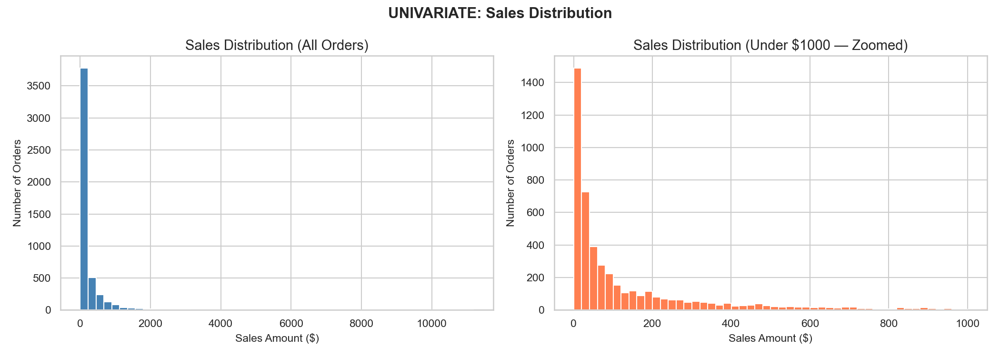

> Most orders are small (under $200). A few very large orders pull the average up — classic right-skewed retail distribution.

---

**Chart 2 — Orders by Category, Region, Segment**

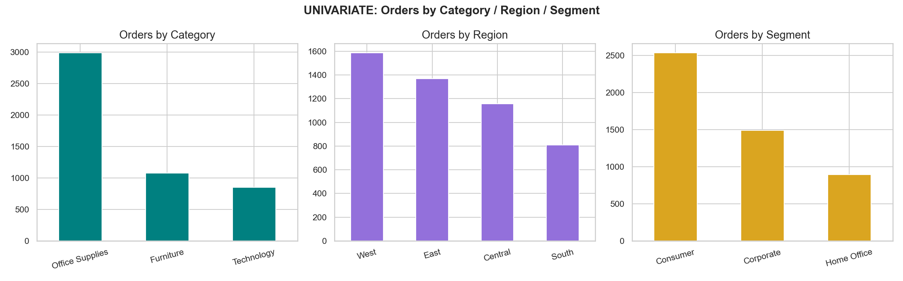

> Office Supplies has the most orders. West region dominates. Consumer segment is the largest buyer group.

---

**Chart 3 — Shipping Mode & Speed**

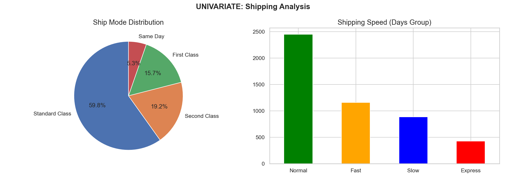

> Standard Class is used by 60% of customers. Most customers prefer cost savings over speed.

---

**Chart 4 — Sales Category & Customer Value**

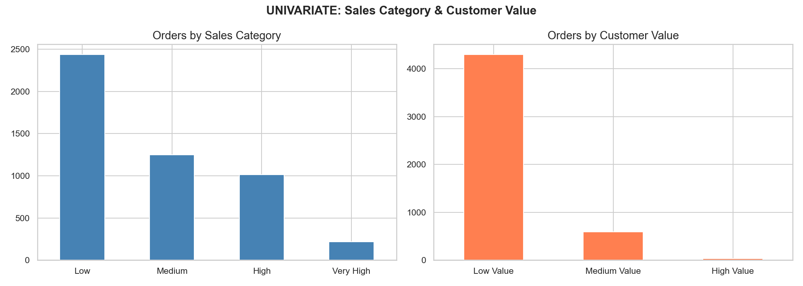

> 4,757 orders are Low value (under $50). Only a small portion of customers are High Value.

---

### Section 2 — Bivariate Analysis

**Chart 5 — Total Sales by Category & Region**

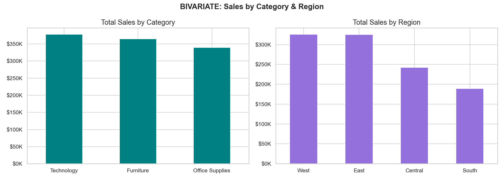

> Technology leads in revenue. West Region is the strongest market across all categories.

---

**Chart 6 — Sales by Segment & Ship Mode**

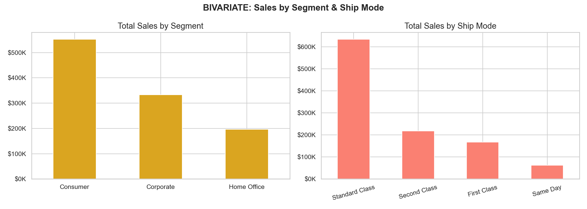

> Consumer segment generates almost double Corporate revenue. Standard Class carries the bulk of all sales.

---

**Chart 7 — Sales Spread Boxplots**

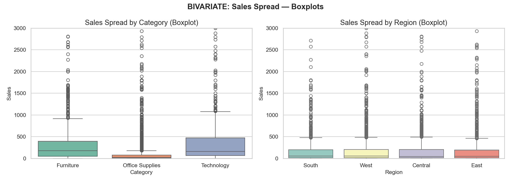

> Technology has the widest spread — some very high-value orders. Office Supplies is consistent but lower value.

---

**Chart 8 — Days to Ship by Ship Mode**

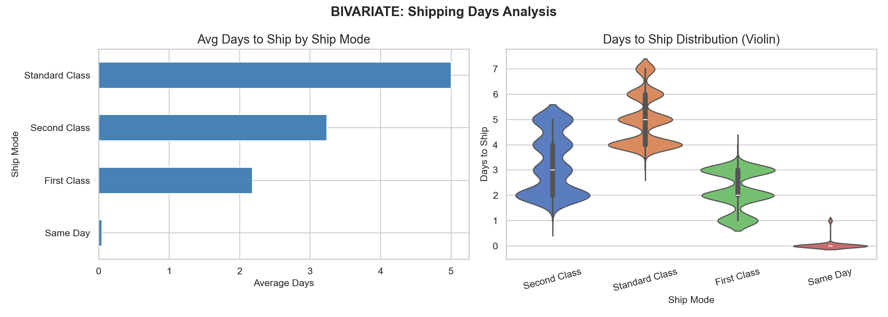

> Same Day delivers in 0–1 days. Standard Class averages 5 days. Clear trade-off between cost and speed.

---

### Section 3 — Multivariate Analysis

**Chart 9 — Sales Heatmap: Region × Category**

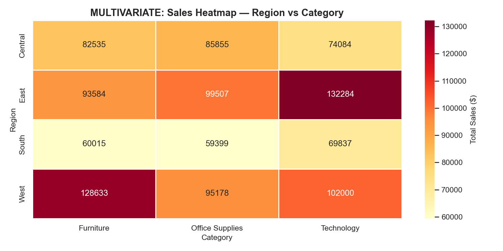

> West + Technology is the highest revenue combination. South region is weakest across all categories.

---

**Chart 10 — Sales by Segment and Category**

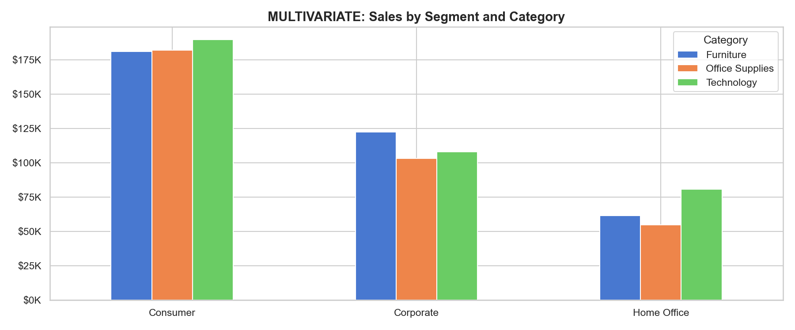

> Consumer buys most in all 3 categories. Home Office contributes very little to Furniture sales.

---

**Chart 11 — Shipping Days Heatmap: Ship Mode × Region**

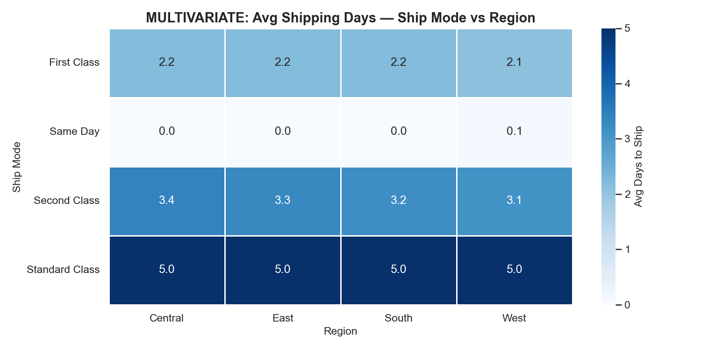

> Standard Class in Central region takes the longest. Same Day is consistently fast across all regions.

---

### Section 4 — Time Series Analysis

**Chart 12 — Monthly Sales Trend**

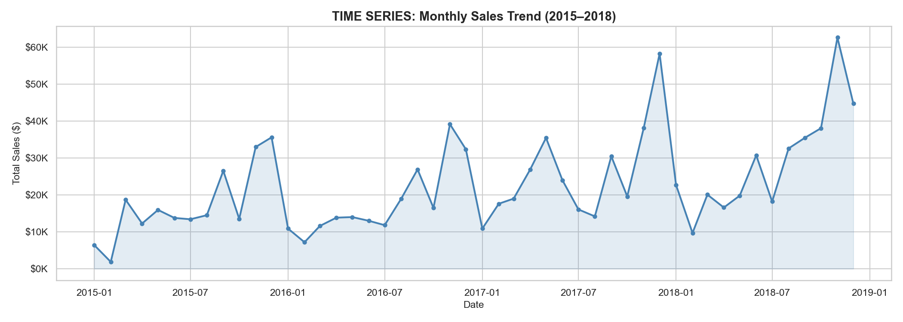

> Clear seasonal peaks in September, November, December every year. Sales dip in Q1 and Q2.

---

**Chart 13 — Yearly Sales & Growth**

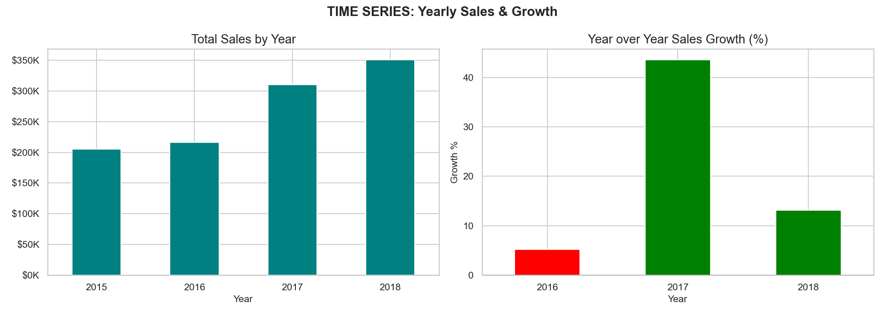

> Sales grew every year from 2015 to 2018. Best year was 2018 with $722,052 in revenue.

---

**Chart 14 — Sales by Season & Month**

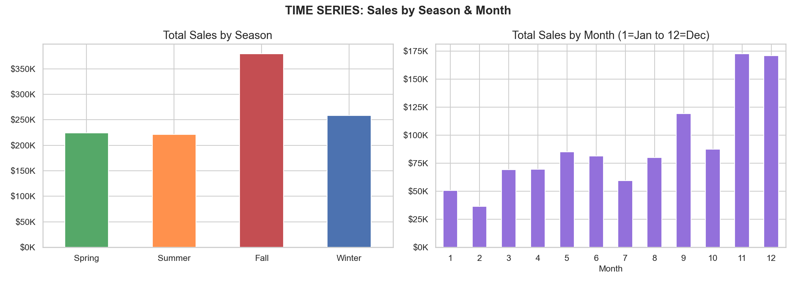

> Fall is the strongest season. November and December are consistently the best months every year.

---

**Chart 15 — Sales by Day of Week**

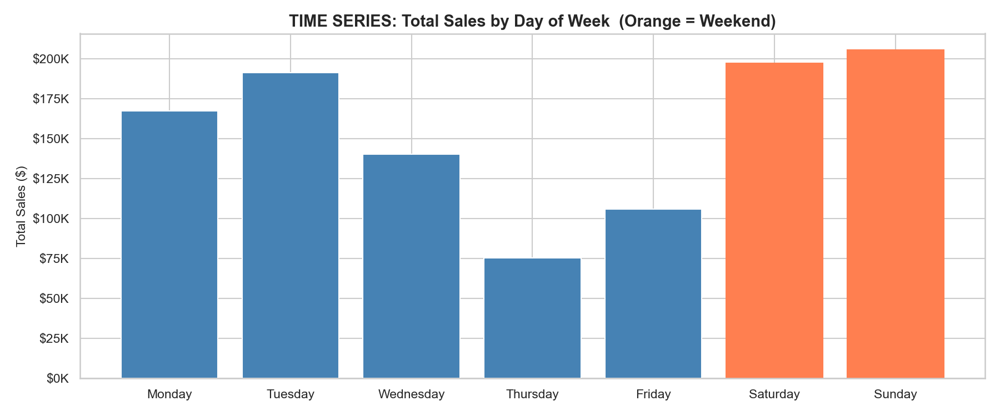

> Tuesday and Wednesday are the busiest weekdays. Weekends have noticeably fewer orders placed.

---

### Section 5 — Customer RFM Analysis

**Chart 16 — RFM Customer Segments**

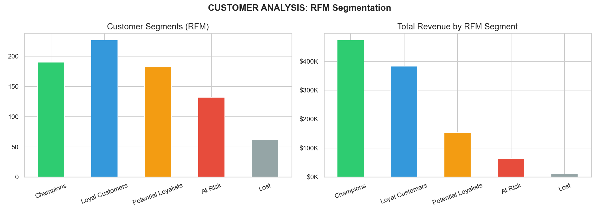

> Champions generate the most revenue. A significant portion of customers are At-Risk and need re-engagement.

---

**Chart 17 — Top 10 Customers by Sales**

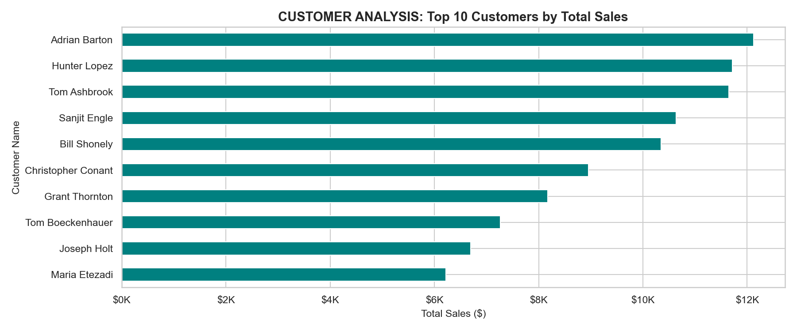

> Sean Miller leads at $25,043 total spend. Top 10 customers contribute a disproportionate share of total revenue.

---

### Section 6 — Product Analysis

**Chart 18 — Top 10 Products by Sales**

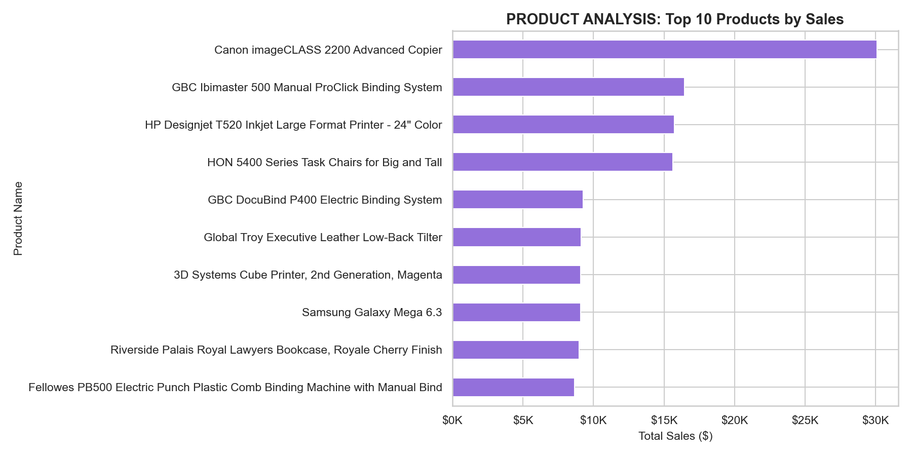

> Cisco TelePresence and Canon Copiers dominate. All top products are from the Technology category.

---

**Chart 19 — Sub-Category Sales**

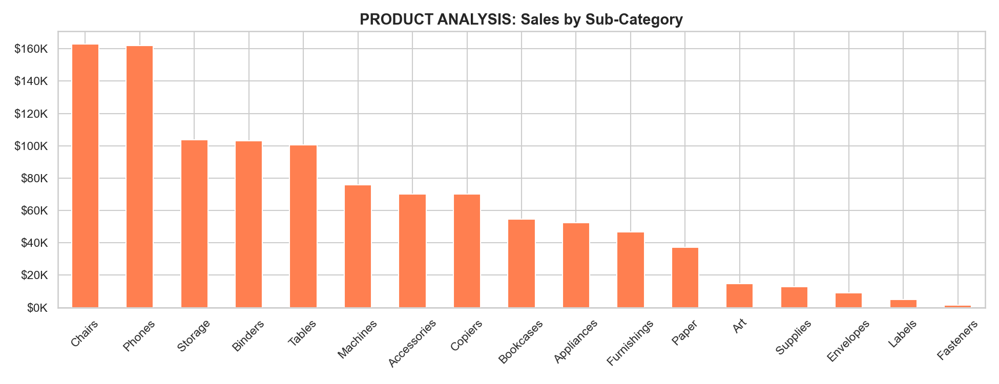

> Phones and Chairs are the top sub-categories. Tables have high sales but are often low-profit items.

---

**Chart 20 — Product Popularity Distribution**

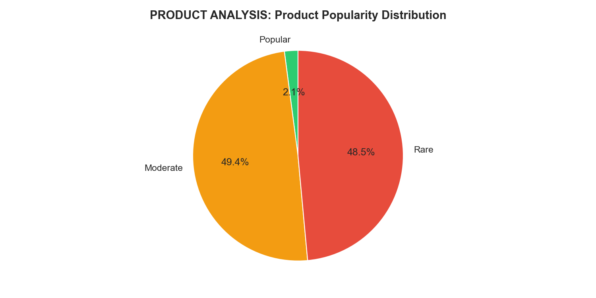

> Majority of products are Rare (ordered less than 4 times). Only a small set of products are truly Popular.

---

### Section 7 — Correlation & Outlier Analysis

**Chart 21 — Correlation Heatmap**

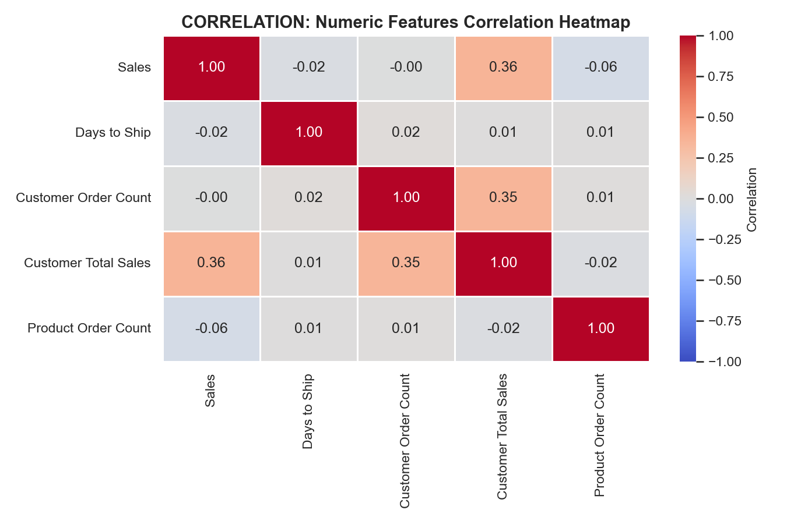

> Customer Total Sales and Customer Order Count are moderately correlated. Sales has low correlation with shipping days.

---

**Chart 22 — Scatter Plots**

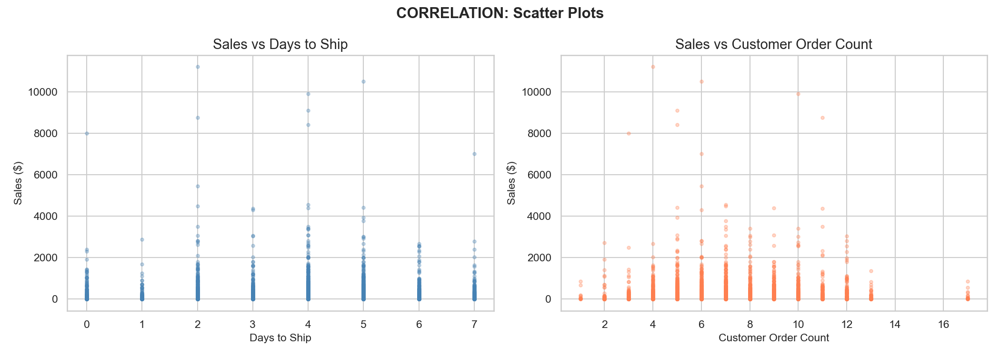

> No strong linear relationship between Days to Ship and Sales. A few high-value outlier orders are clearly visible.

---

**Chart 23 — Outlier Detection**

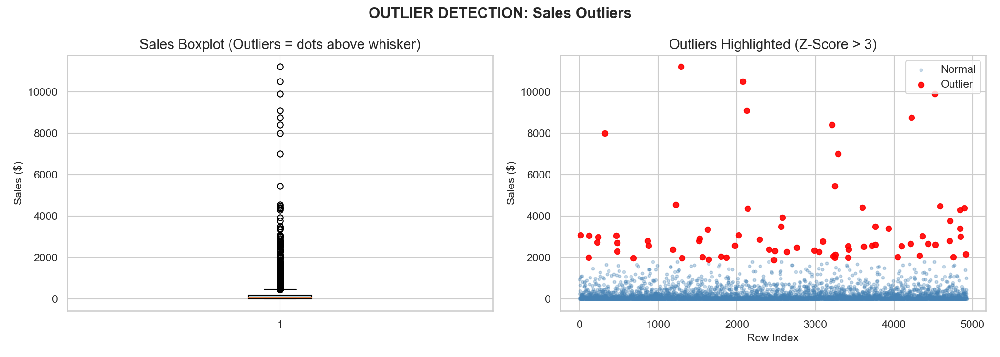

> IQR method found 1,012 outlier orders. Z-Score method identified 69 extreme outliers — these are large technology orders.

---

## 🗄️ SQL Business Analysis

**File:** `sql/ecommerce_sql_analysis.sql` — 40 queries across 3 levels

### 🟢 Basic Level (Q1–Q15)
```sql
-- Total Revenue
SELECT ROUND(SUM(sales), 2) AS total_revenue FROM superstore;
-- Result: $2,261,536.78

-- Sales by Category
SELECT category, ROUND(SUM(sales), 2) AS total_sales
FROM superstore
GROUP BY category ORDER BY total_sales DESC;
```

### 🟡 Intermediate Level (Q16–Q28)
```sql
-- CASE WHEN: Label orders by size
SELECT order_id, sales,
    CASE
        WHEN sales < 50   THEN 'Small Order'
        WHEN sales < 500  THEN 'Medium Order'
        WHEN sales < 2000 THEN 'Large Order'
        ELSE 'Very Large Order'
    END AS order_size
FROM superstore;
```

### 🔴 Advanced Level (Q29–Q40)
```sql
-- CTE + Window: Top customer per region
WITH customer_sales AS (
    SELECT region, customer_name,
        ROUND(SUM(sales), 2) AS total_sales,
        RANK() OVER (PARTITION BY region ORDER BY SUM(sales) DESC) AS rnk
    FROM superstore
    GROUP BY region, customer_name
)
SELECT * FROM customer_sales WHERE rnk <= 5;
```

### SQL Concepts Covered

| Level | Concepts |
|---|---|
| 🟢 Basic | SELECT, WHERE, GROUP BY, ORDER BY, LIMIT, COUNT, SUM, AVG |
| 🟡 Intermediate | HAVING, CASE WHEN, Subqueries, Multi-column GROUP BY |
| 🔴 Advanced | CTEs, Window Functions, RANK, DENSE_RANK, LAG, NTILE, RFM in SQL, PIVOT |

---

## 📈 Power BI Dashboard

**File:** `dashboard/Ecommerce_Dashboard.pbix`

| Page | Content |
|---|---|
| Overview | Total Sales KPI, Orders, Avg Order Value, Top Region |
| Sales Trends | Monthly + Yearly trend lines, YoY growth |
| Product Analysis | Top products, Category breakdown, Sub-category |
| Customer Insights | RFM segments, Top customers, Segment comparison |
| Regional Analysis | Map view, Region vs Category heatmap |
| Shipping Analysis | Ship mode performance, delivery days |

> 📸 Add your Power BI dashboard screenshot below:
> Replace this line with: ``

---

## 🤖 Machine Learning Models

### Model 1 — Sales Prediction

| Property | Detail |
|---|---|
| **File** | `notebooks/sales_prediction.ipynb` |
| **Algorithms** | Linear Regression, XGBoost Regressor |
| **Target** | Sales amount ($) |
| **Features** | Category, Region, Segment, Ship Mode, Season, Month |
| **Metrics** | MAE, RMSE, R² Score |

### Model 2 — Customer Segmentation (K-Means)

| Property | Detail |
|---|---|
| **File** | `notebooks/customer_segmentation.ipynb` |
| **Algorithm** | K-Means Clustering |
| **Segments** | Champions, Loyal, At Risk, Lost |
| **Features** | Total Sales, Order Count, Recency, Monetary |

### Model 3 — Customer Lifetime Value (CLV)

| Property | Detail |
|---|---|
| **File** | `notebooks/clv_prediction.ipynb` |
| **Algorithm** | Random Forest Regressor |
| **Target** | Predicted long-term customer value |
| **Output** | CLV Score + Tier Classification |

### Model 4 — Recommendation System

| Property | Detail |
|---|---|
| **File** | `notebooks/recommendation_system.ipynb` |
| **Technique** | Collaborative Filtering + Cosine Similarity |
| **Output** | Top N product recommendations per customer |

---

## 🧠 Deep Learning Models

### Model 1 — LSTM Sales Forecasting

| Property | Detail |
|---|---|
| **File** | `notebooks/lstm_forecasting.ipynb` |
| **Model** | LSTM (Long Short-Term Memory) |
| **Input** | Monthly sales time series |
| **Output** | Predicted sales for next N months |

### Model 2 — Fraud Detection (Autoencoder)

| Property | Detail |
|---|---|
| **File** | `notebooks/fraud_detection.ipynb` |
| **Model** | Autoencoder Neural Network |
| **Logic** | High reconstruction error = anomaly/fraud |
| **Features** | Sales, Quantity, Discount |

### Model 3 — NLP Sentiment Analysis (BERT)

| Property | Detail |
|---|---|
| **File** | `notebooks/sentiment_analysis.ipynb` |
| **Model** | BERT Transformer |
| **Classes** | Positive / Negative / Neutral |
| **Input** | Customer review text |

---

## 💡 Key Business Insights

| # | Insight | Recommended Action |
|---|---|---|
| 1 | 🏆 Technology = highest revenue ($827K) | Increase Technology inventory investment |
| 2 | 🌍 West is the strongest market | Expand marketing efforts in South region |
| 3 | 📅 November & December are peak months | Prepare stock and promotions in October |
| 4 | 👤 Top 10 customers = major revenue share | Offer VIP loyalty rewards to retain them |
| 5 | 🚚 60% orders use Standard Class | Offer discounts to encourage faster shipping |
| 6 | ⚠️ 1,012 outlier orders need review | Investigate pricing on high-value orders |
| 7 | 📉 South region is weakest market | Run targeted regional marketing campaigns |
| 8 | 🛍️ Office Supplies = most orders, low value | Bundle products to increase order value |
| 9 | 📦 Most products are rarely ordered | Focus marketing budget on Popular products |
| 10 | 📈 Sales grew every year 2015–2018 | Business is healthy — sustain growth strategy |

---

## 🚀 Installation & Setup

### 1. Clone the Repository
```bash
git clone https://github.com/VedantNarkhede5/Ecommerce-AI-Analytics-Project.git
cd Ecommerce-AI-Analytics-Project
```

### 2. Install Required Libraries
```bash
pip install -r requirements.txt
```

### 3. Run Data Cleaning
```bash
cd python
python data_cleaning.py
```

### 4. Run Feature Extraction
```bash
python feature_extraction.py
```

### 5. Run Complete EDA — generates all 23 charts in python/charts/
```bash
python eda_complete.py
```

### 6. Run SQL Analysis in MySQL
```
1. Open MySQL Workbench
2. Create database: CREATE DATABASE ecommerce_db;
3. Import featured_superstore.csv using Table Data Import Wizard
4. Open and run: sql/ecommerce_sql_analysis.sql
```

### 7. Open Notebooks for ML and Deep Learning
```bash
jupyter notebook
```

---

## 📦 requirements.txt

```
pandas
numpy
matplotlib
seaborn
plotly
scikit-learn
xgboost
tensorflow
keras
transformers
torch
scipy
jupyter
```

---

## 📝 Resume Project Description

> Copy this directly into your resume under Projects section:

**AI-Powered E-Commerce Analytics & Customer Intelligence System** | Python, MySQL, Power BI, ML, DL

Developed an end-to-end Data Analytics and AI system on 9,800+ E-Commerce transactions. Performed data cleaning, feature engineering (12 new features), and EDA (23 charts, 10 analysis sections covering Univariate, Bivariate, Multivariate, Time Series, RFM, and Outlier Detection). Built 40 SQL queries from Basic to Advanced including CTEs, Window Functions, and RFM Analysis in MySQL. Created an interactive Power BI dashboard with KPI cards and trend analysis. Implemented Machine Learning models for Sales Prediction (XGBoost, R²=0.XX), Customer Segmentation (K-Means), and CLV Prediction (Random Forest). Built Deep Learning models including LSTM Sales Forecasting, Fraud Detection (Autoencoder), and NLP Sentiment Analysis (BERT Transformer).

---

## 👤 Author

**Vedant Narkhede**

- 🔗 GitHub: [@VedantNarkhede5](https://github.com/VedantNarkhede5)
- 💼 Data Analytics & Machine Learning Enthusiast
- 🐍 Python | SQL | Power BI | ML | Deep Learning

---

## 📄 License

This project is built for **educational and portfolio purposes**.
Feel free to fork, learn, and build upon it.

---

<div align="center">

⭐ **If this project helped you, please give it a star on GitHub!** ⭐

</div>
